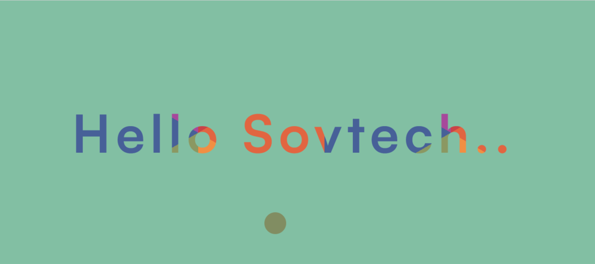

<div align="center">
  <h3 align="center">Noko Collins Moeketsi SovTech Challenge</h3>

  <p align="center">
    <br />
    <a href="https://nokocollins.netlify.app/">Live Link</a>
  </p>
</div>



## Getting started 

Make sure Node & Git are installed 

## Clone repo
```
git clone https://github.com/collins-nc/mini-portfolio
cd mini-portfolio
```

## Install dependencies: 
```
npm install
```

## Run application
```
npm start
```
